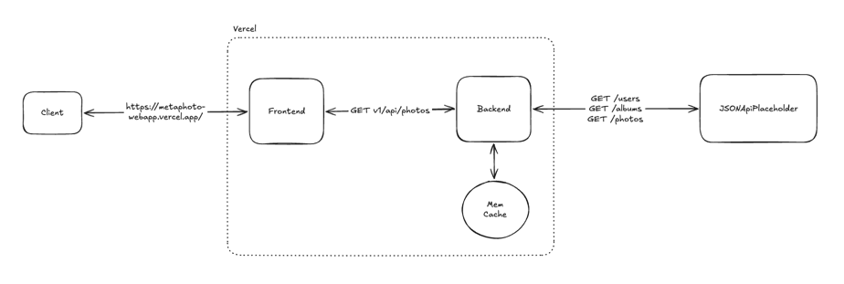
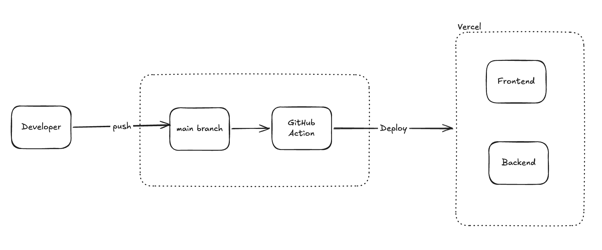
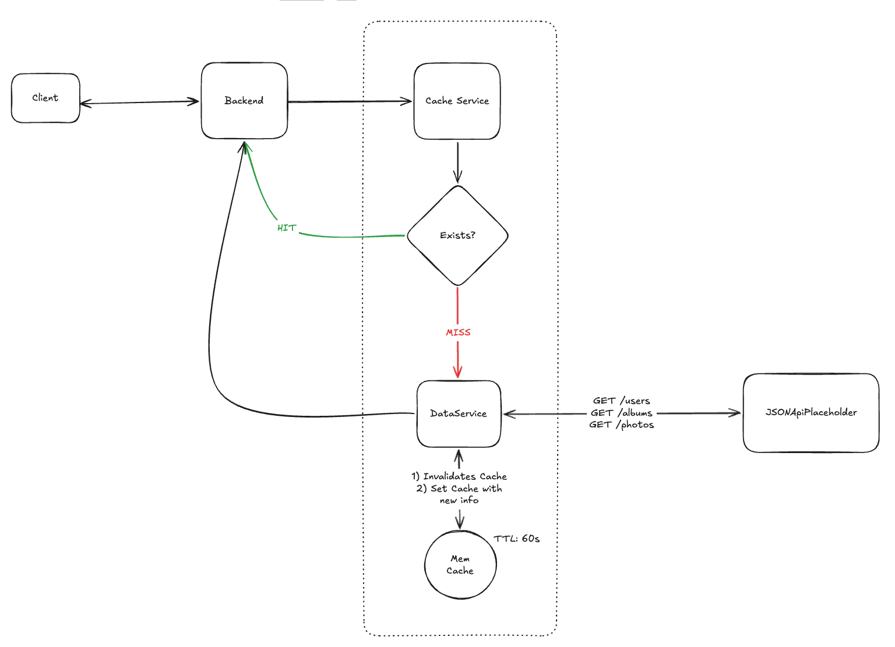

# MetaPhoto

A photo library WebApp built for the MetaPhoto technical test. It provides an enriched photo API (backend) and a browsable SPA (frontend).

## Live Demo

> https://metaphoto-webapp.vercel.app/

---

## Architecture

### Request Flow


### CI/CD Pipeline


### Cache Strategy


---

## Project Structure

```
metaphoto/
├── backend/          # Node.js + Express API
│   └── src/
├── frontend/         # React SPA
│   └── src/
├── .github/
│   └── workflows/deploy.yml   # CI/CD via GitHub Actions → Vercel
├── vercel.json
└── README.md
```

---

## Features

### Part 1 — API Endpoint

| Method | Endpoint | Description |
|---|---|---|
| GET | `/v1/api/photos` | List photos with filters and pagination |
| GET | `/v1/api/photos/:id` | Single enriched photo |

#### Filters
| Param | Match type | Example |
|---|---|---|
| `title` | contains | `?title=accusamus` |
| `album.title` | contains | `?album.title=quidem` |
| `album.user.email` | equals | `?album.user.email=Sincere@april.biz` |

These filters can be combined.

#### Pagination
| Param | Default | Description |
|---|---|---|
| `limit` | 25 | Max items to return |
| `offset` | 0 | Starting index |

### Part 2 — Web Application

- Browse all photos in a responsive grid
- Filter by photo title, album title, or user email
- Click any photo for a full detail modal
- Paginated navigation with configurable page size (10, 25, 50, 100)

---

## Running Locally

### Prerequisites
- Node.js >= 18

### 1. Install dependencies

```bash
# From repo root
npm run install:all
```

### 2. Start both servers
```bash
# From repo root — starts backend and frontend concurrently
npm run dev
```

Or run them separately:
```bash
# Terminal 1 - Backend (http://localhost:3001)
npm run dev:backend

# Terminal 2 - Frontend (http://localhost:3000)
npm  run dev:frontend
```

---

## Deployment — Vercel

This project is configured for Vercel's deployment. The backend runs as a serverless function and the frontend is served as a static build.

### CI/CD (GitHub Actions)

On every push to `main`, the workflow in `.github/workflows/deploy.yml`:
1. Installs dependencies for both backend and frontend
2. Builds the React app
3. Deploys to Vercel (production)

Pull requests get a preview deployment automatically.

#### Required GitHub Secrets

| Secret | Where to get it                                                   |
|---|-------------------------------------------------------------------|
| `VERCEL_TOKEN` | Vercel Token                                                      |
| `VERCEL_ORG_ID` | Vercel Org Id (Both projects should be configued in the same org) |
| `VERCEL_PROJECT_ID_BACKEND` | Vercel Backend project Id                                         |
| `VERCEL_PROJECT_ID_FRONTEND` | Vercel Frontend project Id                                        |
